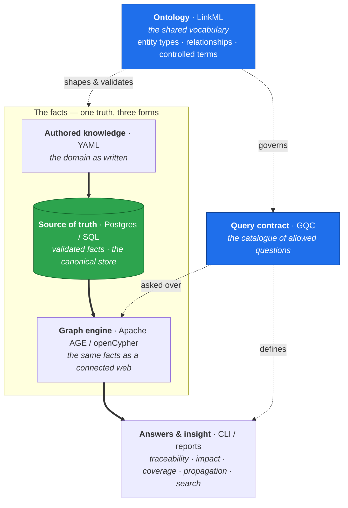

# alm-ontology

Application Lifecycle Management ontology — a semantic layer that turns a read-only
ALM analytics warehouse into a traceability graph (the "digital thread").

This repository is a **production-oriented runnable skeleton** for the spine
**model → regenerable graph view → tooling**, with the discipline *tables are truth,
the graph is a regenerable view, the model is the schema.*

See [docs/architecture.md](docs/architecture.md) for the full design.

## The three layers

| Layer | Realization |
|---|---|
| **Model (spine)** | A single LinkML schema → generated Pydantic types, SQL DDL, docs |
| **Substrate** | Committed authored YAML -> rebuilt Postgres warehouse tables |
| **Graph/query contract** | Apache AGE/openCypher + recursive SQL + rustworkx, governed by GQC |
| **In-memory inference** | rustworkx — auditable DAL propagation & traceability paths |

The graph engines are rebuilt from the tables; automated cross-engine checks assert
their `impact` results agree, proving the graph is a faithful regenerable view. The
first formal Graph Query Contract (GQC) capability is
[`impact.gqc.yaml`](projects/vm-e1-sparrow/gqc/impact.gqc.yaml).

### The concepts and how they layer

The story is one of **meaning, facts, and questions**. An *ontology* fixes the
shared vocabulary; the *facts* are instances of it, held in a single source of
truth and projected into a graph; a *query contract* fixes which questions may be
asked. The ontology governs every layer — it shapes the facts, names the graph,
and constrains the questions — which is what keeps the answers trustworthy.



Read it top-down for governance (the ontology reaching every layer) and
left-spine-down for data flow (authored → truth → graph → answers).

### How each concept is instantiated

| Concept | Realization in this repo |
|---|---|
| **Ontology** | LinkML schema [`alm.yaml`](projects/vm-e1-sparrow/model/alm.yaml) → generated Pydantic types, SQL DDL, docs |
| **Source of truth** | Committed `projects/vm-e1-sparrow/data/*.yaml`, validated, loaded into Postgres warehouse node + edge tables |
| **Graph** | Rebuilt from the tables on demand — *tables are truth, the graph is a regenerable view* |
| **Query contract** | GQC specs [`*.gqc.yaml`](projects/vm-e1-sparrow/gqc/), validated against the ontology's classes & slots |
| **Graph engines** | Apache AGE / openCypher · recursive SQL · rustworkx (in-memory) — one contract, asserted to agree |
| **Search exposures** | Postgres full-text search · pgvector semantic similarity |
| **Answers** | impact · coverage · DAL propagation · refines closure · search |

## Quickstart

```bash
uv sync                          # create .venv and install
uv run almon model gen           # generate Pydantic types, SQL DDL, docs from the LinkML model
docker compose up -d --build     # start Postgres+AGE+pgvector
uv run almon build               # load data/ -> Postgres warehouse tables
uv run almon graph rebuild       # optional: persist the AGE graph
uv run almon validate            # structural + cross-entity completeness checks
uv run almon coverage --min-dal A
uv run almon impact --req REQ-0007 --engine all
uv run almon graph run impact --req REQ-0007 --no-rebuild
uv run almon rebuild-exposures
uv run almon search "battery thermal"
uv run --extra embeddings almon rebuild-exposures --semantic
uv run --extra embeddings almon similar "battery thermal containment"
uv run almon propagate
uv run almon report --topic full # -> .cache/projects/<project>/report/<date>/full-<HHMM>.{md,html}
uv run almon serve               # browse reports at http://localhost:8000
```

## Data contract

Each project is self-contained under [`projects/<name>/`](projects/) for authored
inputs: model, dataset, GQC specs, and config. Generated artifacts live under
`.cache/projects/<name>/`. The active project is set in
`pyproject.toml` under `[tool.almon]`; today it is
[`vm-e1-sparrow`](projects/vm-e1-sparrow/).

The bundled [`projects/vm-e1-sparrow/data/`](projects/vm-e1-sparrow/data/) tree is a
fully fictional VM-E1 example dataset. It is there to exercise the tooling and carries
the dummy-data notice inside the data folder. The repository itself is intended to be
reusable with production ALM data that conforms to the normalized contract documented
in [docs/data-contract.md](docs/data-contract.md).

## The bundled example domain

A single-seat electric light aircraft, **VM-E1 *Sparrow***. The data lives under
[`projects/vm-e1-sparrow/data/`](projects/vm-e1-sparrow/data/) in three folders:

- **`requirements/`** — the binding specification (the *what*): requirements with a
  Design Assurance Level (DAL A–E), acceptance criteria, and `refines` chains;
  co-located test cases that `verify` requirements with a passed/failed/not-run outcome.
- **`architecture/`** — the technical breakdown (the *how*): components and their
  composition, component diagrams, interaction/sequence diagrams, and the allocation
  of requirements to components. Authored *from* the requirements.
- **`defects/`** — problems that violate requirements and manifest in affected
  architecture components.
