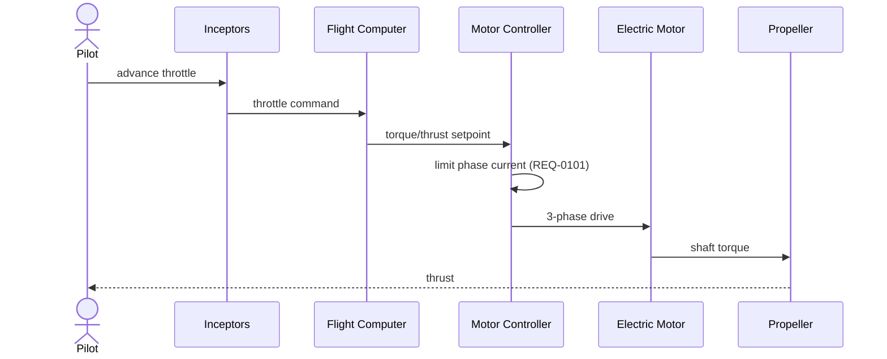
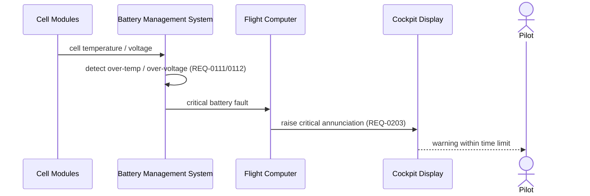
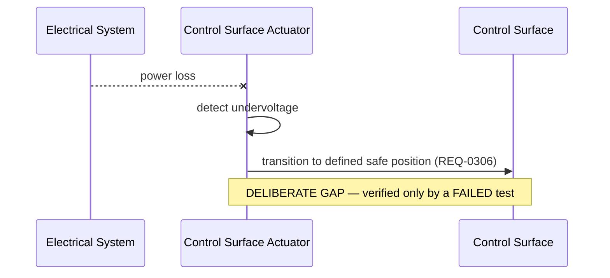

# VM-E1 *Sparrow* — Interaction / Sequence Diagrams

> ⚠️ FULLY AI-GENERATED DUMMY EXAMPLE — NOT FOR REAL-WORLD USE. See [../README.md](../README.md).

Authored behaviours of the VM-E1, traceable to the [requirements](../requirements/requirements.yaml).

## 1. Throttle command → thrust (REQ-0100, REQ-0101, REQ-0102)

## 2. Battery fault → pilot annunciation (REQ-0111, REQ-0112, REQ-0203)

## 3. Loss of power → actuator fail-safe (REQ-0306)

