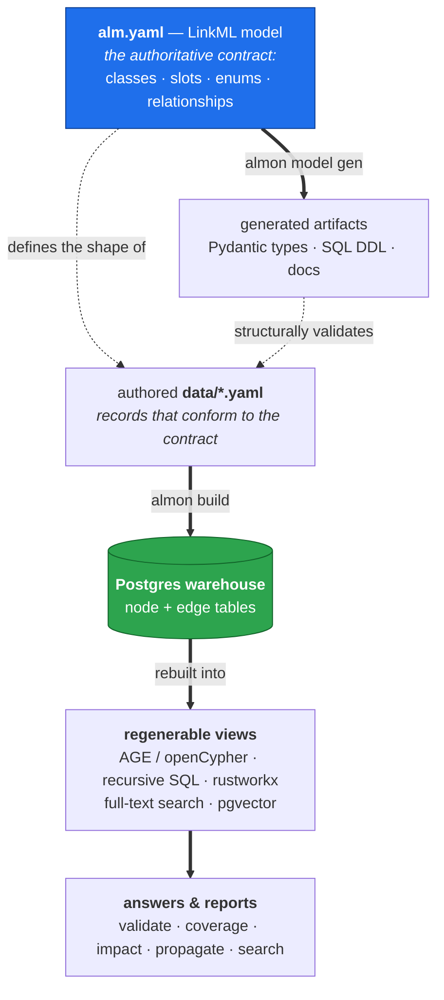

# Data Contract

This repository is reusable when upstream ALM data is normalized into the contract
below. Source-specific adapters may read Codebeamer, Jama, Polarion, DOORS, Jira, CSV
exports, or other systems, but they should emit this contract before validation,
warehouse loading, graph rebuilding, search indexing, or report generation.

## The model defines this contract

The authority for everything in this document is the LinkML model
[`projects/<name>/model/alm.yaml`](../projects/vm-e1-sparrow/model/alm.yaml). It declares the
four classes (`Requirement`, `ArchitectureElement`, `TestCase`, `Defect`), their
slots, the controlled vocabularies (`DALEnum`, `ElementKindEnum`, `OutcomeEnum`,
`SeverityEnum`, `DefectStatusEnum`), and the relationships. **The Record Contract and
Relationship Contract tables below are a human-readable projection of that model —
the model is the source of truth, not this page.**

Why this matters in practice:

- `uv run almon model gen` generates Pydantic types, SQL DDL, and docs *from*
  `alm.yaml`. The generated Pydantic types are what `uv run almon validate` uses to
  structurally check authored `data/`, so the contract is **enforced** by the model,
  not merely described here.
- The allowed values in the field tables (DAL, kind, outcome, severity, status) are
  exactly the model's `permissible_values`.
- To change the contract — add a field, a relationship, or a vocabulary value — edit
  `alm.yaml` and regenerate; this page and the adapters then follow it (see
  [Adapter Abstraction](#adapter-abstraction)).

### From model to data to derived views



Read it top-down: the **model** both *generates* the validation artifacts and
*defines the shape* the authored data must take; validated data becomes the warehouse
**source of truth**; every graph, search, and answer downstream is a regenerable view
of it. See [docs/architecture.md](architecture.md) for the layers in depth.

## Boundary

The contract starts at the authored dataset root, the active project's `data/`
folder (currently `projects/vm-e1-sparrow/data/`). Everything downstream is derived:

- LinkML structural validation reads the merged dataset.
- Referential validation checks relationship targets.
- The Postgres warehouse replaces its node and edge tables from the validated
  dataset.
- AGE, recursive SQL, rustworkx, full-text search, pgvector, CLI answers, and reports
  are regenerated views over those warehouse tables.

The contract is therefore the normalized input shape, not a raw export format.

## Dataset Layout

```text
projects/<name>/data/
  requirements/
    requirements.yaml
    tests.yaml
  architecture/
    architecture.yaml
    components.md      # optional narrative/diagram companion
    sequences.md       # optional narrative/diagram companion
  defects/
    defects.yaml
```

The YAML files are merged into one LinkML `Dataset` with four collections:

- `requirements`
- `architecture_elements`
- `test_cases`
- `defects`

Markdown files may provide human-readable diagrams or notes, but the current loader
does not treat them as warehouse facts.

## Record Contract

`Requirement`

| Field | Required | Meaning |
|---|---:|---|
| `id` | yes | Stable requirement identifier. |
| `title` | yes | Short human-readable label. |
| `statement` | yes | Binding requirement text. |
| `acceptance` | yes | Acceptance criteria or evidence rule. |
| `dal` | yes | Criticality level, currently `A`, `B`, `C`, `D`, or `E`. |
| `rationale` | no | Reasoning or process context. |
| `refines` | no | Parent requirement ids this requirement decomposes. |

`ArchitectureElement`

| Field | Required | Meaning |
|---|---:|---|
| `id` | yes | Stable architecture element identifier. |
| `name` | yes | Human-readable name. |
| `kind` | yes | `system`, `subsystem`, or `component`. |
| `description` | yes | Element description. |
| `composed_of` | no | Child architecture element ids. |
| `satisfies` | no | Requirement ids allocated to this element. |

`TestCase`

| Field | Required | Meaning |
|---|---:|---|
| `id` | yes | Stable verification identifier. |
| `title` | yes | Short human-readable label. |
| `description` | yes | Verification description. |
| `verifies` | yes | The single requirement id verified by this test. |
| `outcome` | yes | `passed`, `failed`, or `not_run`. |

`Defect`

| Field | Required | Meaning |
|---|---:|---|
| `id` | yes | Stable defect identifier. |
| `title` | yes | Short human-readable label. |
| `description` | yes | Defect description. |
| `severity` | yes | `critical`, `major`, or `minor`. |
| `status` | yes | `open`, `in_analysis`, `fixed`, or `closed`. |
| `affects` | yes | Architecture element ids where the defect manifests. |
| `violates` | yes | Requirement ids the defect violates. |

## Relationship Contract

Relationships are authored as ids embedded in records, then flattened into edge
tables:

| Authored slot | Source | Target | Warehouse edge |
|---|---|---|---|
| `refines` | requirement | requirement | `edge_refines(src, dst)` |
| `composed_of` | architecture element | architecture element | `edge_composed_of(parent, child)` |
| `satisfies` | architecture element | requirement | `edge_satisfied_by(req, element)` |
| `verifies` | test case | requirement | scalar column on `test_cases` |
| `affects` | defect | architecture element | `edge_affects(defect, element)` |
| `violates` | defect | requirement | `edge_violates(defect, req)` |

Every referenced id must exist in the appropriate collection. The loader derives
`Requirement.satisfied_by` from `ArchitectureElement.satisfies`; adapters should not
author both directions independently.

## Identifier And Lifecycle Rules

- Ids are globally unique within the dataset and stable across rebuilds.
- Id changes represent identity changes; renames should update `title` or `name`, not
  `id`.
- Deleted upstream items should be omitted from the normalized dataset only when the
  source-of-record lifecycle policy says they are no longer active analytical facts.
- Adapters should preserve upstream ids or maintain a deterministic id map.
- Free-text fields should be plain text or Markdown-safe text; HTML should be
  normalized before loading.

## Validation Gates

A production dataset should pass these gates before derived views are trusted:

1. `uv run almon validate` passes structural and referential validation.
2. Completeness checks report expected coverage status, especially for critical
   requirements.
3. `uv run almon graph validate-gqc` passes for every checked-in graph query
   contract.
4. Cross-engine checks agree for graph capabilities where multiple renderers exist.
5. Dataset-specific GQC fixtures cover at least one positive, one negative, and one
   boundary case for critical graph questions.

## Adapter Abstraction

Keep production integrations outside the core graph/query code:

1. Extract raw artifacts from upstream systems.
2. Normalize them into the LinkML `Dataset` collections above.
3. Run structural and referential validation.
4. Build the warehouse and all derived views from the normalized dataset.

If another domain needs different entities, relationships, or vocabularies, change
the active project's `model/alm.yaml` first, regenerate with `uv run almon model gen`,
then update adapters and GQC specs to match the new model.
