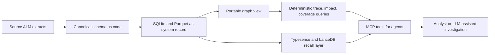
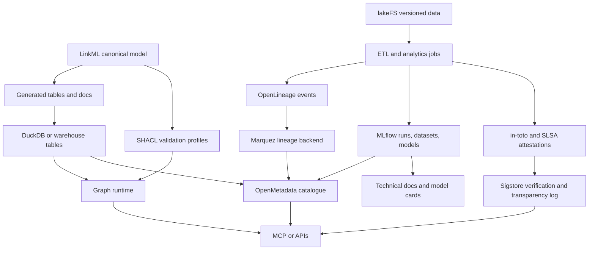
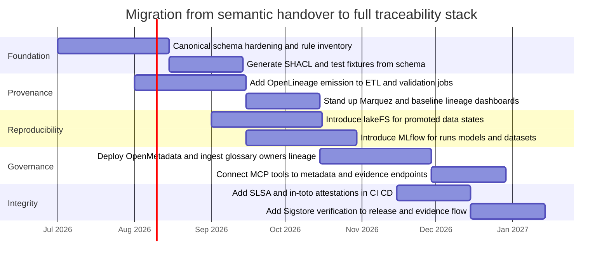

# Critical Review of the ALM Knowledge Graph Handover and a Stronger Traceability Architecture

## Executive summary

The provided handover is unusually strong on architectural discipline. Its core ideas — **formats over engines**, **model once, generate many**, **tables as truth**, **graph as regenerable view**, **separating fuzzy recall from deterministic verification**, and keeping the stack in a **read-only analytics posture** — are all well aligned with durable data-engineering practice and with the direction of current graph and metadata standards. In particular, the decision not to let a niche graph database become the system of record looks prescient in light of Kuzu’s archival in October 2025 and Cozo’s apparent stagnation. citeturn14view0turn15view2turn15view3turn15view5

However, the handover is much stronger on **semantic modelling and query portability** than on **end-to-end AI traceability and evidential governance**. It proposes a robust semantic/query spine, but it does **not yet specify a first-class control plane** for provenance collection, lineage interoperability, experiment reproducibility, model/system documentation, signed attestations, access governance, or tamper-evident audit trails. Those omissions matter because modern traceability is not only about expressing relationships such as *refines*, *allocates to*, and *verifies*; it is also about proving **who ran what, on which data, with which code, under which policy, and whether the resulting artefacts can be independently rebuilt and verified**. W3C PROV, OpenLineage, NIST AI RMF, the EU AI Act, SLSA, in-toto, and Sigstore all point in that direction. citeturn28view0turn20view0turn17view0turn35view1turn35view2turn20view1turn21view0turn29view1

My overall judgement is therefore:

- **Keep** the handover’s architectural principles, especially its model/engine separation and regenerable graph view.
- **Upgrade** the implementation choice around the graph/query layer, because a standards-first bet on SQL/PGQ is strategically sound but still operationally immature when realised through a community DuckDB extension.
- **Add** a missing governance plane: lineage collection, metadata cataloguing, experiment/model tracking, reproducibility controls, and verifiable attestations.
- **Prefer** a layered toolchain in which the semantic model, execution lineage, metadata catalogue, versioned data, model tracking, and signed evidence are separate but linked.

In short, the handover is a **good semantic architecture**; it is **not yet a complete AI traceability architecture**. That distinction is the key finding of this report. citeturn15view3turn20view0turn23view0turn21view4turn29view1turn30view1

## What the handover gets right and where it is thin

The handover’s most defensible design choice is its insistence that the graph layer remain **derivative** rather than authoritative. That stance closely matches the modern view of property-graph querying embodied by SQL/PGQ: graphs can be defined as views over relational data rather than forcing organisations to migrate their primary records into a separate native graph store. The academic and standards literature around GQL and SQL/PGQ treats this convergence between relational and graph systems as a major design direction, while DuckPGQ explicitly positions itself as a DuckDB community extension implementing SQL/PGQ over analytical workflows. citeturn37academia6turn15view3turn36view0

That design also fits the handover’s stated reality: the warehouse is read-only, analytics-oriented, and small enough in its requirements/architecture core to tolerate regeneration and in-memory processing. DuckDB is a natural fit for this style of local analytical processing because it reads Parquet efficiently and exposes a SQLite extension for direct access to SQLite databases, reinforcing the handover’s “boring substrate, swappable semantic layer” strategy. citeturn6view0turn6view1

The second major strength is the explicit separation between **recall** and **precision**. The handover keeps Typesense and LanceDB for retrieval and insists that semantic validation remain deterministic. That is exactly the right line to draw. Typesense’s own documentation distinguishes semantic and hybrid retrieval, while LanceDB positions itself as a multimodal AI lakehouse with table versioning, schema evolution, vector search, full-text search, and SQL. These are retrieval and curation primitives, not compliance engines. Treating them as candidate generators rather than as sources of truth reduces category errors and makes auditability materially better. citeturn12view0turn10view3turn10view4

A third strength is the handover’s instinct to collapse process definition and executable constraint artefacts into one version-controlled model. That instinct is very close to what W3C SHACL, LinkML, and related schema-as-code approaches make possible. LinkML explicitly supports authoring schemas in YAML, validating data across multiple serialisations, and generating artefacts for other frameworks; SHACL defines validation of RDF graphs against shapes and explicitly supports re-usable shapes graphs for validation, interface generation, and integration. citeturn38view1turn38view3turn28view2turn28view3

The thin spots are equally clear. The handover does not define a standard provenance model. W3C PROV exists precisely to describe the entities, activities, and agents involved in producing data so that users can assess its quality, reliability, and trustworthiness. The handover models domain semantics well, but it does not yet model *run provenance* — ingestion runs, validation runs, rule execution, query execution, attestation generation, evidence bundle production, or user/system decision provenance. citeturn28view0turn28view1

It also lacks an explicit reproducibility and integrity strategy. MLflow tracks parameters, code versions, metrics, models, and datasets; DVC and lakeFS provide versioning and reproducible checkpoints for data and models; in-toto, SLSA, and Sigstore add verifiable provenance, signatures, identity binding, and append-only transparency logging. None of those functions is currently first-class in the handover, which means the architecture can explain relationships but cannot yet provide a full evidential chain from raw extract to compliance conclusion. citeturn23view0turn21view2turn21view4turn20view1turn21view0turn29view1turn30view1

The result is an architecture that is semantically coherent but governance-light. That is not a fatal flaw; it simply means the handover should be taken as a **semantic/query design handover**, not as a finished traceability/governance blueprint. citeturn17view0turn35view1turn35view2

The diagram above captures why the handover is fundamentally sensible: the system record is tabular and durable, while the graph and MCP layers remain replaceable. What it does **not** yet show is a missing parallel plane for provenance, reproducibility, and signed evidence. citeturn20view0turn23view0turn29view1

## Layer-by-layer critique

A practical way to evaluate the handover is to separate **what the document explicitly names** from **what it describes functionally**. The document explicitly names SQLite, Parquet, Typesense, LanceDB, Kuzu, Cozo, and MCP. It describes, but does not explicitly name, a YAML schema language, a mainstream embedded columnar engine, a standards-based property-graph layer, an in-memory Rust-backed graph library, and a reserve RDF/SPARQL port. In the table below, unnamed layers are mapped to their most plausible implementation class; those identifications are **inferences**, not claims that the handover explicitly selected those products.

### Original layers and recommended replacements

| Original layer or tool in the handover | Stated function | Main issues | Recommended alternative or upgrade | Why |
|---|---|---|---|---|
| YAML schema language, evidently LinkML-like | Single source of truth for schema, validation, docs, generation | Very good choice; main gap is that provenance/event schemas are not modelled alongside the domain model | **Keep LinkML**, but pair it with **SHACL** profiles for externally verifiable graph constraints | LinkML is strong for schema-as-code and generation; SHACL adds a standard validation contract for interoperable semantic validation. citeturn38view1turn38view3turn28view2turn27view1 |
| SQLite | Durable local system record | Good portability, but limited for large analytical joins and governance metadata management | **Keep SQLite** as interchange substrate, but make **DuckDB** the analytical execution plane | DuckDB reads SQLite and Parquet well and is better suited to analytical pushdown, scans, and local OLAP. citeturn6view0turn6view1 |
| Parquet | Analytical storage and cloud escape hatch | Good format decision; gap is absence of lineage and version semantics | **Keep Parquet**, but put it behind **lakeFS** for object-level versioning and governed promotion flows | lakeFS applies Git-like branching, commits, and immutable checkpoints to object-store data, which materially improves traceability. citeturn21view4 |
| Typesense | Search across requirements/architecture | Excellent recall layer, but weak as an evidence or governance layer | **Keep for retrieval**, but integrate search results with a metadata catalogue and signed evidence trail | Typesense supports semantic and hybrid search, but search hits should be input, not proof. citeturn12view0 |
| LanceDB | Disk vector store for defects | Strong retrieval and multimodal curation; still not a governance system | **Keep if defect retrieval matters**, but align it with lineage and experiment metadata | LanceDB offers table versioning and schema evolution, which is useful; it still needs a provenance plane above it. citeturn10view3turn10view4 |
| MCP server | Agent/tool boundary | Good interface idea, but no built-in provenance, policy, or evidence packaging | **Keep MCP**, but add policy enforcement, audit logging, and evidence envelopes around tool invocations | MCP is a transport/protocol layer, not a governance layer; those concerns must be added around it. citeturn9view0turn9view1 |
| Embedded columnar engine, plausibly DuckDB | Local analytical muscle over SQLite/Parquet | Strong choice, but needs clear status as the authoritative execution engine beneath graph views | **DuckDB** with clear testing and version pinning | Aligns with the handover’s local-first analytical posture and with DuckPGQ if SQL/PGQ remains desired. citeturn6view0turn6view1turn15view3 |
| Standards-based property-graph contract, plausibly DuckPGQ / SQL/PGQ | Portable, view-based graph queries | Strategically elegant, but still operationally maturing; risk of depending on a community extension for critical compliance flows | **Two-path strategy:** keep **DuckPGQ** for exploratory/local SQL-first graph work, but use **Neo4j** or another mature graph runtime if graph operations become production-critical | SQL/PGQ is strategically important, but implementation maturity still trails the architectural ambition. Neo4j is operationally more mature, though less standards-pure. citeturn15view3turn36view0turn26view0 |
| In-memory Rust-backed traversal library, plausibly rustworkx | Explicit, testable rule execution and traversal | Good for auditable code, but risks semantic drift if business rules are duplicated separately from formal constraints | **Keep rustworkx** for auditable algorithms, but generate test oracles from the same model and mirror key constraints in SHACL/SQL tests | rustworkx is high-performance and suitable for explicit algorithms; the risk is governance drift, not library capability. citeturn39view2turn39view3 |
| Reserve RDF/SPARQL port | Standards interchange | Sensible to defer, but too underspecified for interop planning | **Apache Jena + SHACL** as the reserve standards port | Jena offers mature SHACL implementation, SPARQL support, and a better standards story than an ad hoc future port. citeturn27view1turn27view2 |
| Kuzu and Cozo | Previously considered embedded graph engines | Kuzu was archived; Cozo shows signs of inactivity and remained pre-1.0 | **Do not adopt as strategic core** | The handover is right to walk away; this is a textbook case of lifecycle risk in niche infra. citeturn14view0turn15view2 |

### Critical reading of the layered design

The schema layer is the strongest part of the handover. In present best practice, a schema layer should do more than define entities; it should bind together domain ontology, validation rules, documentation artefacts, and downstream contracts. LinkML is a credible fit for that role because it treats the model as code, supports YAML authoring, validation across serialisations, and generation into several downstream forms. Where the current handover should go further is in treating **provenance entities, execution events, decisions, controls, and evidence bundles** as part of the same model family rather than as operational afterthoughts. citeturn38view1turn38view3turn28view0

The warehouse substrate is sound. SQLite and Parquet are durable formats; DuckDB gives the architecture a fast local analytical execution layer; and the “graph as regenerable view” idea both reduces lock-in and makes disaster recovery simpler. This is fully consistent with the handover’s “formats over engines” theme and with the direction of SQL/PGQ. citeturn6view0turn6view1turn37academia6turn15view3

The graph layer is the most conceptually attractive and the most operationally fragile part. The handover is correct that recursive SQL is an awkward host for semantically typed, variable-length domain reasoning. The move to a formal graph layer is justified. The problem is that **query-language standardisation has progressed faster than implementation maturity**. GQL is now an ISO standard, and SQL:2023 added SQL/PGQ, but the concrete open tooling for production-grade SQL/PGQ remains comparatively young. That does not invalidate the direction; it means the handover should explicitly distinguish **strategic contract** from **today’s production runtime**. citeturn36view0turn37academia6turn15view3

The rule/inference layer is valuable because explicit, unit-tested code can be more auditable than opaque reasoning. That is especially true for safety evidence. But the handover itself hints at the risk: once inference is implemented in imperative code, the architecture needs a traceable link from policy text to rule implementation to test evidence. Without that, “auditable code” can still drift away from the formal process model. A strong fix is to require every substantive rule to have: a model identifier, a code implementation, a golden test case, and an evidence output with versioned inputs. This aligns with NIST AI RMF’s trustworthiness orientation and with the AI Act’s documentation and logging requirements for higher-risk systems. citeturn17view0turn35view0turn35view1turn35view2

The retrieval layer is correctly separated from the semantic layer, but it is too isolated from metadata governance. Typesense and LanceDB can stay, but both should emit identifiers that resolve into a shared metadata catalogue and provenance ledger. Otherwise, the architecture will answer “why did we retrieve this object?” only partially. citeturn12view0turn10view3turn20view6

## Literature, standards, and tool survey

### Comparative matrix of candidate tools and libraries

The matrix below mixes open-source and commercial-supported/open-core options that are directly relevant to traceability, provenance, reproducibility, and governance. The ratings for maturity, integration complexity, and cost are evaluative synthesis based on official documentation, licensing, release cadence, ecosystem breadth, and operational footprint.

| Tool or stack | Licence | Primary language or interface | Maturity | Scalability | Standards support | Provenance and traceability features | Integration complexity | Security features | Cost posture |
|---|---|---:|---|---|---|---|---|---|---|
| **LinkML** citeturn38view3 | Apache-2.0 | YAML, Python; generators for several targets | Medium-high | High for modelling; not a runtime store | Linked data conventions; export/generation across frameworks | Strong schema traceability; weak native run provenance | Medium | Depends on generated/runtime targets | Low |
| **Apache Jena + SHACL** citeturn27view1turn28view2 | Apache-2.0 | Java, SPARQL, RDF | High | High | W3C RDF, SPARQL, SHACL | Strong standards-based validation and semantic interchange | Medium-high | Mature server/runtime controls in broader Jena/Fuseki stack | Low-medium |
| **DuckDB + DuckPGQ** citeturn6view0turn15view3 | DuckDB open source; DuckPGQ open source community extension | SQL, Python, R, Java, Node | Medium | High on analytical workloads | SQL:2023-directional support via SQL/PGQ implementation | Good query trace potential; weak native governance metadata | Medium | In-process model reduces surface; governance features limited | Low |
| **Neo4j** citeturn26view0 | Open-core/commercial mix | Cypher, drivers for major languages | High | High | Cypher, RDF integration add-ons; not SQL/PGQ-first | Strong graph ops; provenance patterns possible but not native standards-first | Medium | Mature authz, clustering, backup, monitoring docs | Medium-high |
| **MLflow** citeturn23view0turn41view2 | Apache-2.0 | Python, REST, Java, R | High | High | No external provenance standard by default | Logs parameters, code versions, metrics, models, datasets; clear experiment lineage | Low-medium | Access control and managed options available; not tamper-evident by itself | Low-medium |
| **OpenLineage + Marquez** citeturn20view0turn41view1 | Apache-2.0 | OpenAPI/event model, JVM/Python ecosystem integrations | High | High | OpenLineage specification | Excellent job/run/dataset lineage across heterogeneous systems | Medium | Back-end security depends on deployment; standardised metadata helps auditability | Low-medium |
| **OpenMetadata** citeturn24view0turn24view3turn41view5 | Apache-2.0 | Java/Python ecosystem, UI, APIs | High | High | Metadata and lineage interoperability, connectors, data contracts | Strong catalogue, lineage, governance, observability, data-quality-as-code | Medium-high | Secure deployment guidance; governance and access patterns stronger than lightweight OSS tools | Medium |
| **DVC** citeturn21view2turn41view3 | Apache-2.0 | Python, Git-based workflow | High | Medium-high | Git-centred rather than formal provenance standards | Versioning for data/models, experiments, reproducible pipelines | Low-medium | Git-integrated controls; not cryptographic attestation by itself | Low |
| **lakeFS** citeturn21view4turn41view4 | Apache-2.0 | Go, object-storage interfaces, APIs | High | High | Storage-agnostic versioning conventions | Branching, commits, immutable checkpoints, hooks, promotion patterns | Medium | Access controls and branch protection patterns; good operational governance | Medium |
| **Great Expectations** citeturn21view6turn41view6 | Apache-2.0 | Python | High | Medium-high | Data-quality expectations rather than semantic web standards | Strong validation and documentation of tabular data assumptions | Low-medium | Depends on deployment; no cryptographic integrity on its own | Low-medium |
| **Typesense** citeturn12view0turn40view0 | GPL-3.0 | C++, HTTP APIs, client libraries | High | High | Search APIs; not a provenance standard | Good retrieval diagnostics; weak formal provenance | Low-medium | Production docs, HA, access management guidance | Low-medium |
| **LanceDB** citeturn10view3turn41view0 | Apache-2.0 | Python, TypeScript, Rust | Medium-high | High | SQL/full-text/vector interfaces | Table versioning, schema evolution, multimodal retrieval | Medium | Depends on deployment tier; more data-management aware than many vector stores | Low-medium |
| **in-toto + SLSA + Sigstore** citeturn21view0turn20view1turn29view1turn30view1 | Open standards/open-source ecosystem | CLI and multiple language clients | High | High | in-toto attestations, SLSA provenance, Sigstore bundle/transparency log | Best-in-class for signed build provenance, attestations, and transparency logging | Medium | Strongest security story in this matrix: identity binding, signing, transparency log, verification | Low-medium |

### Recent papers and standards most relevant to this architecture

The papers and standards below are the most decision-relevant items from the last five years, with two older but foundational W3C standards included because the handover is explicitly about ontology/provenance and would otherwise be under-contextualised.

| Paper or standard | Year | Short annotated summary | Why it matters here |
|---|---:|---|---|
| **Graph Pattern Matching in GQL and SQL/PGQ** citeturn37academia6 | 2021 | Explains the common pattern-matching core behind emerging ISO graph standards and the relational-to-property-graph bridge | Directly validates the handover’s view that graph queries can sit over relational tables |
| **PG-Schema** citeturn13academia6 | 2022 | Proposes a schema formalism for property graphs, filling a gap in practical graph systems | Supports the handover’s concern that graph semantics need formal schema support, not just edges |
| **GPC: A Pattern Calculus for Property Graphs** citeturn13academia3 | 2022 | Distils the semantics of GQL/SQL-PGQ pattern matching into a more rigorous calculus | Relevant for avoiding ad hoc graph semantics in compliance queries |
| **Zero-knowledge Proof Meets Machine Learning in Verifiability** citeturn31academia0 | 2023 | Surveys verifiable ML, especially ZKP-based approaches to proving computation integrity | Important for the “verifiable computation” strand missing from the handover |
| **Trav-SHACL** citeturn16academia3 | 2021 | Shows efficient validation of SHACL constraint networks at scale | Good evidence that standards-based validation need not be too slow for practical use |
| **yProv4ML** citeturn31academia2 | 2025 | Argues that mainstream ML tracking tools still under-serve standardised lineage; proposes PROV-JSON provenance capture with minimal code changes | Highly relevant to the handover’s missing ML/AI provenance layer |
| **SHACL-DS** citeturn25academia4 | 2025 | Extends SHACL thinking from single RDF graphs to RDF datasets with named-graph context | Useful if this architecture evolves towards multi-graph evidence packaging |
| **HERITRACE** citeturn25academia3 | 2026 | Demonstrates SHACL-driven RDF curation with provenance and change tracking, without requiring users to be Semantic Web experts | Strong evidence that standards-based curation and provenance can be operational, not merely theoretical |
| **ISO/IEC 39075 GQL** citeturn36view0 | 2024 | First ISO standard for property graph data structures and operations | Confirms that the handover’s standards-based graph instinct is not speculative |
| **SQL:2023 with SQL/PGQ** citeturn15view3turn37academia6 | 2023 | Adds property graph queries over SQL data via PGQ concepts | Best standards anchor for the handover’s “graph as view over tables” design |
| **NIST AI RMF 1.0 and GenAI profile** citeturn17view0 | 2023–2024 | Risk-management framework and companion profile for trustworthy AI governance | Strong basis for governance processes, control mapping, and testing requirements |
| **EU AI Act** citeturn34view0turn35view1turn35view2turn35view3 | 2024 | Requires technical documentation, data governance, record-keeping, and logging capabilities for high-risk contexts | Makes explicit why governance, logging, and evidence generation cannot be optional |
| **SLSA provenance and in-toto** citeturn20view1turn21view0turn30view1 | 2023–2026 ecosystem maturity | Define how build provenance, attestation, and verification should work | These are the missing “secure logging/verifiable evidence” pieces |
| **W3C PROV** citeturn28view0 | 2013 | Foundational provenance model for entities, activities, and agents | Old but still the cleanest conceptual baseline for provenance modelling |
| **W3C SHACL** citeturn28view2 | 2017 | Foundational standard for machine-readable graph constraints | Old but still the most relevant interoperable validation layer for semantic constraints |

### Independent survey not tied to the handover

A clean, independent way to frame the field is as a pipeline from **concepts** to **papers/standards** to **tools**:

- **Concept: semantic contract and graph meaning.** Recent work around GQL, SQL/PGQ, PG-Schema, and GPC shows that rigorous graph querying is moving towards standardisation, but schema and semantics still need explicit treatment. Candidate tools: LinkML, SHACL, DuckPGQ, Neo4j, Apache Jena. citeturn37academia6turn13academia6turn13academia3turn15view3turn27view1
- **Concept: execution lineage and provenance.** W3C PROV provides the conceptual grammar; OpenLineage makes lineage interoperation practical; yProv4ML shows the continuing gap between ML tooling and standard provenance. Candidate tools: OpenLineage, Marquez, MLflow extended with PROV export, OpenMetadata. citeturn28view0turn20view0turn31academia2turn23view0turn24view3
- **Concept: reproducibility and state versioning.** DVC and lakeFS turn data/model states into versioned, reproducible checkpoints. Candidate tools: DVC, lakeFS, MLflow. citeturn21view2turn21view4turn23view0
- **Concept: secure evidence and verifiable supply chains.** SLSA, in-toto, and Sigstore make provenance verifiable rather than merely descriptive. Candidate tools: Cosign/Sigstore, in-toto attestations, SLSA-aligned CI. citeturn20view1turn21view0turn29view1turn30view1
- **Concept: data and graph validation.** SHACL, Trav-SHACL, HERITRACE, and Great Expectations show complementary ways to encode expectations and validate whether the evidence base satisfies them. Candidate tools: Apache Jena, pySHACL-class tooling, Great Expectations. citeturn28view2turn16academia3turn25academia3turn21view6

That survey leads naturally to an architecture that is more governance-centric than the handover while preserving its modelling discipline.

## Independent alternative architecture

The alternative below is intentionally **not** derived from the original handover. It starts instead from modern traceability requirements and works backward.

### Alternative architecture and rationale

The most robust independent architecture would have six explicit planes:

1. **Schema and semantic contract:** LinkML for the canonical domain schema, plus SHACL for interoperable graph constraints.  
2. **Data/version plane:** lakeFS for object/data versioning and promotion, optionally paired with DVC for repository-local experiment and artefact workflows.  
3. **Execution provenance plane:** OpenLineage events collected into Marquez or another compatible backend.  
4. **Metadata and governance plane:** OpenMetadata as the searchable catalogue tying together datasets, jobs, lineage, contracts, owners, glossary terms, data quality, and policies.  
5. **Experiment and model plane:** MLflow for runs, datasets, metrics, models, and technical-documentation inputs.  
6. **Integrity and attestation plane:** in-toto/SLSA/Sigstore for signed provenance, verification, and tamper-evident evidence packages.

Graph querying then becomes a **consumer** of these layers rather than the centre of gravity. If graph analytics are crucial, use Neo4j for operational maturity or DuckDB + DuckPGQ for a SQL-first local workflow. Either way, the graph runtime is **downstream of model, metadata, lineage, and signed evidence**, not a substitute for them. citeturn24view3turn20view0turn23view0turn21view4turn21view2turn29view1turn30view1

This architecture is preferable when the organisation cares about **auditability, interoperability, policy control, and external assurance** at least as much as it cares about graph traversal convenience. It costs more in operational overhead than the handover’s design, but it closes the biggest gaps in provenance, reproducibility, and security. citeturn20view0turn24view3turn23view0turn29view1turn20view1turn21view0

### Why this alternative is stronger

The main advantage is that this alternative treats traceability as a **cross-cutting evidence fabric** rather than as a graph-query problem. It makes it possible to answer not only “what is connected to what?” but also:

- which data version was used;
- which transformation/job produced the derived relation;
- which code version and parameters were active;
- which model or rule implementation was run;
- whether the artefact can be rebuilt;
- whether the result is signed and independently verifiable;
- who owns the asset and what policy applies.

That is a materially better fit for AI governance expectations under NIST AI RMF and, where relevant, the AI Act’s documentation, data governance, record-keeping, and logging expectations. citeturn17view0turn35view1turn35view2turn35view3

### Migration plan

A reasonable migration plan from the handover’s current direction to the stronger alternative is incremental rather than revolutionary.

This staged path preserves the handover’s most valuable feature — its lean semantic core — while filling the provenance and governance gaps without forcing a big-bang rewrite. citeturn20view0turn23view0turn21view4turn29view1turn20view1

## Risks, compliance, tests, and limitations

### Risk and compliance checklist

| Area | What should exist | Why it matters |
|---|---|---|
| Semantic contract | Versioned canonical schema, generated docs, machine-readable constraints | Prevents prose drift and establishes a stable meaning contract |
| Provenance | Entity/activity/agent model for ingestion, validation, inference, and reporting | Without this, the architecture traces data relationships but not evidence production citeturn28view0 |
| Lineage interoperability | OpenLineage-compatible event capture for jobs and datasets | Avoids bespoke lineage silos and supports heterogeneous stack integration citeturn20view0 |
| Documentation | Machine-generated technical documentation and system/model reports | Needed for governance and for explainable operational evidence citeturn17view0turn35view0 |
| Logging | Automatic logs over system lifetime for high-risk contexts | Explicit regulatory expectation in the AI Act for relevant settings citeturn35view1turn35view2 |
| Data governance | Dataset quality criteria, bias checks, retention and provenance of collection purpose | Required by good practice and reflected in AI Act data-governance expectations citeturn35view3 |
| Reproducibility | Versioned inputs, code versions, parameters, immutable checkpoints, rebuild tests | Needed to prove analyses and models can be reconstructed citeturn23view0turn21view2turn21view4 |
| Integrity | Signed attestations, verification policy, transparency log, release evidence | Converts descriptive provenance into verifiable provenance citeturn20view1turn21view0turn29view1 |
| Access governance | Role-based access, secrets handling, tool invocation logging, policy checks | Prevents provenance leakage and unauthorised evidence manipulation |
| Search governance | Retrieval hits linked to canonical IDs and evidence graph | Prevents the fuzzy retrieval layer becoming an ungoverned parallel truth system |

### Suggested tests and benchmarks

The handover will benefit from a fairly strict testing regime.

**Semantic and graph correctness tests.** Every rule should have golden fixtures: at least one positive case, one negative case, and one borderline case. For recursive/path semantics, use snapshot tests on known mini-graphs, with explicit expectations for transitive closure, missing coverage, and contradictory states. Where the graph layer and the rule-code layer can express the same result, require **cross-engine agreement tests** so that no rule quietly diverges between SHACL, SQL, and imperative code. This is especially important if ASIL propagation remains implemented as auditable code rather than a formal reasoner. citeturn27view1turn27view2turn39view2

**Provenance completeness tests.** Define mandatory provenance fields for each job and evidence artefact: source identifier, schema version, data version, code version, actor identity, timestamps, and downstream artefact identifiers. Then test for missingness and referential integrity. If OpenLineage is adopted, treat event completeness as a quality gate. citeturn20view0turn28view0

**Reproducibility benchmarks.** At fixed checkpoints, rebuild the same warehouse slice and the same derived graph from versioned inputs. Measure whether hashes, row counts, constraint outcomes, and key query outputs match exactly or within defined tolerances. MLflow, DVC, and lakeFS all support parts of this workflow, but the organisation must define success thresholds itself. citeturn23view0turn21view2turn21view4

**Retrieval-versus-verification benchmarks.** For each MCP verb that uses search as a first stage, capture candidate recall, false-positive rate, and the proportion of retrieved items later rejected by deterministic checks. This will make the handover’s “LLM proposes; ontology disposes” principle measurable rather than rhetorical. Typesense’s hybrid retrieval features and LanceDB’s multimodal retrieval make this feasible, but they do not measure it for you. citeturn12view0turn10view3

**Integrity and attestation tests.** If signed evidence is adopted, CI should fail closed on invalid signatures, missing attestations, mismatched subject digests, or missing transparency-log inclusion proofs. SLSA provenance and Sigstore verification are only useful when enforced by policy. citeturn20view1turn29view1turn30view1

### Open questions and limitations

A few points remain genuinely open.

The first is implementational: some layers in the handover are described functionally rather than by product name. In this report I treated **LinkML**, **DuckDB**, **DuckPGQ**, and **rustworkx** as the most plausible concrete instantiations because they fit the described capabilities unusually closely, but that mapping is still an inference rather than an explicit statement from the handover.

The second is strategic: the handover’s SQL/PGQ direction is sound, but the operational choice between a standards-forward but younger implementation and a more mature graph runtime remains unresolved. That is a trade-off between future portability and current operational certainty, not a simple right-or-wrong call. citeturn15view3turn26view0turn36view0

The third is scope: the handover is intentionally a design-rationale document rather than a runnable specification. That means some of the critique here is about **missing operational detail** rather than incorrect design. The most important missing details are provenance schemas, event capture points, policy enforcement, exception handling, retention, and evidence packaging.

The last limitation is that standards and regulations continue to move. NIST’s AI RMF is under revision, and AI governance obligations are still maturing in practice; any production implementation should therefore treat the governance plane as a living control system rather than as a one-off architecture deliverable. citeturn17view0

Taken together, the best reading of the handover is this: it already contains the right **semantic discipline**. To become a genuinely rigorous traceability architecture, it now needs the missing **provenance, reproducibility, security, and governance discipline** layered around it.