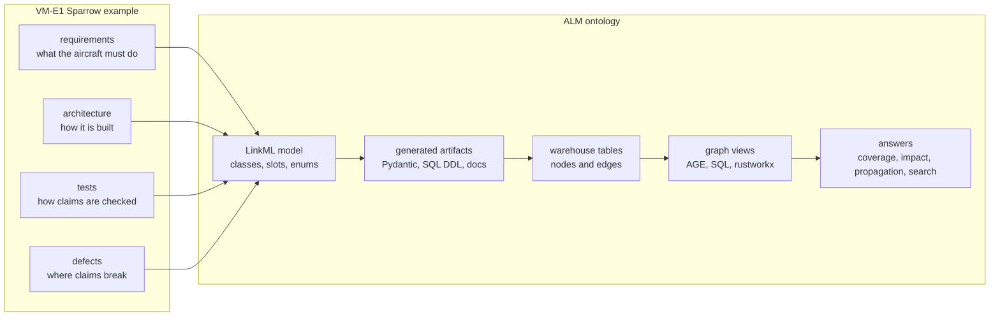
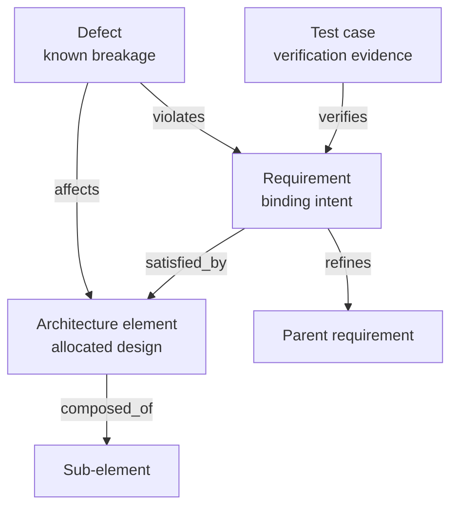
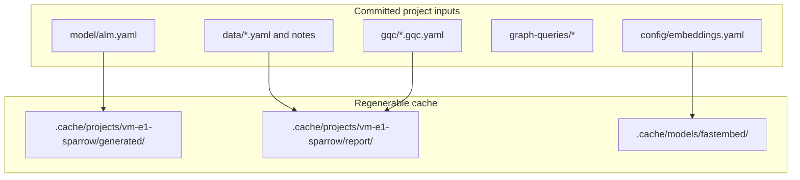

# VM-E1 Sparrow Project

> Warning: fully AI-generated dummy example, not for real-world use.
>
> Every requirement, architecture element, test case, defect, safety level (DAL),
> diagram, and analysis in this project is fictional and was generated by AI purely
> to exercise the tooling. The "VM-E1 Sparrow" aircraft does not exist. None of this
> data, and none of the safety classifications or analyses derived from it, may be
> reused, cited, or relied upon in any real engineering, certification, or safety
> context.

VM-E1 Sparrow is the example project that makes the ALM ontology tangible. The
aircraft story gives the ontology something concrete to organize: requirements,
architecture elements, tests, and defects. The ontology gives the story a strict
shape: classes, slots, relationships, controlled vocabularies, generated validators,
warehouse tables, graph views, and reports.

The useful point is the connection between the two. The project is not just a pile
of sample YAML, and the ontology is not just a schema in isolation. Together they
show how authored engineering knowledge can become an executable traceability model.

## The Link

The story supplies domain facts. The model decides what a valid fact is. The
warehouse is rebuilt from valid facts. The graph and reports are rebuilt from the
warehouse.

## Traceability Shape

Those labels are not just diagram text. They are the relationship slots in
[`model/alm.yaml`](model/alm.yaml), and the authored project data must use them
consistently. That is what lets one requirement become a coverage question, an
impact trace, a DAL propagation input, or a searchable document.

## Project Boundary

Everything under this project folder is authored input or project configuration.
Generated files live under `.cache/` and can be recreated.

## What Is Here

| Path | Role |
|---|---|
| [`model/alm.yaml`](model/alm.yaml) | The LinkML schema of record for this project. |
| [`data/`](data/) | The fictional authored dataset: requirements, architecture, tests, and defects. |
| [`gqc/`](gqc/) | Graph Query Contract capabilities that name supported graph questions. |
| [`graph-queries/`](graph-queries/) | Lower-layer AGE/openCypher and Postgres SQL query evidence for the current renderers. |
| [`config/embeddings.yaml`](config/embeddings.yaml) | Semantic search embedding profile configuration. |
| [`project.yaml`](project.yaml) | Lightweight project manifest and local layout notes. |

## A Practical Reading Order

1. Start with [`model/alm.yaml`](model/alm.yaml) to see the vocabulary.
2. Read [`data/README.md`](data/README.md) to see how the fictional facts are organized.
3. Inspect one GQC file, such as [`gqc/impact.gqc.yaml`](gqc/impact.gqc.yaml), to see how a question
   is made explicit.
4. Inspect [`graph-queries/`](graph-queries/) to see the current lower-layer AGE/openCypher and SQL
   forms behind those capabilities.
5. Run `uv run almon model gen`, then `uv run almon validate`, once the Postgres substrate is
   available.

The root [CLI reference](../../docs/cli-reference.md) lists which commands need Docker and what each
command regenerates.
