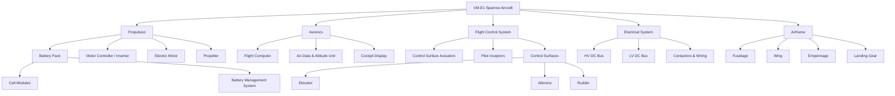
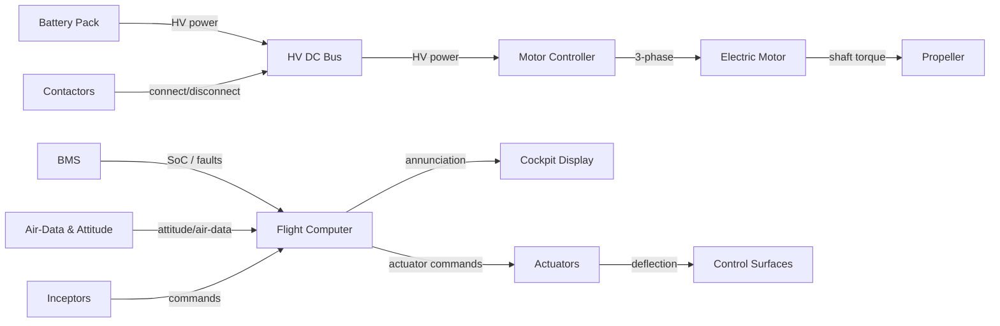

# VM-E1 *Sparrow* — Component Architecture

This is the authored technical breakdown of the VM-E1, derived **from** the
[binding requirements](../requirements/requirements.yaml). It records the components,
their composition, and which requirements each is allocated (`satisfies`). It mirrors
the machine-readable [architecture.yaml](architecture.yaml).

## Composition (the `composed_of` tree)

## Powertrain signal/energy interfaces

## Allocation summary (`satisfies`)

| Element | Allocated requirements |
|---|---|
| VM-E1 Aircraft (ARC-AC) | — (system reqs REQ-0001..0004 decomposed via `refines`, not directly allocated) |
| Propulsion (ARC-PROP) | REQ-0100 |
| Battery Pack (ARC-BATT) | REQ-0110, REQ-0115 |
| Cell Modules (ARC-CELL) | REQ-0114 |
| Battery Management System (ARC-BMS) | REQ-0111, REQ-0112, REQ-0113 |
| Motor Controller (ARC-MCTRL) | REQ-0101 |
| Electric Motor (ARC-MOTOR) | REQ-0102 |
| Propeller (ARC-PROPELLER) | REQ-0103 |
| Flight Computer (ARC-FC) | REQ-0200, REQ-0203, REQ-0204 |
| Air-Data & Attitude (ARC-ADAHRS) | REQ-0201 |
| Cockpit Display (ARC-DISP) | REQ-0202, REQ-0205 |
| Flight Control System (ARC-FCS) | REQ-0300 |
| Actuators (ARC-ACT) | REQ-0301, REQ-0306 |
| Inceptors (ARC-INCEPT) | REQ-0302, REQ-0307 |
| Elevator / Ailerons / Rudder | REQ-0303 / REQ-0304 / REQ-0305 |
| Electrical System (ARC-ELEC) | REQ-0400 |
| HV Bus / LV Bus (ARC-HVBUS / ARC-LVBUS) | REQ-0401 / REQ-0402 |
| Contactors & Wiring (ARC-CONT) | REQ-0403, REQ-0404, REQ-0405 |
| Airframe (ARC-FRAME) | REQ-0500 |
| Fuselage / Wing / Empennage / Gear | REQ-0504 / REQ-0501 / REQ-0502 / REQ-0503 |
