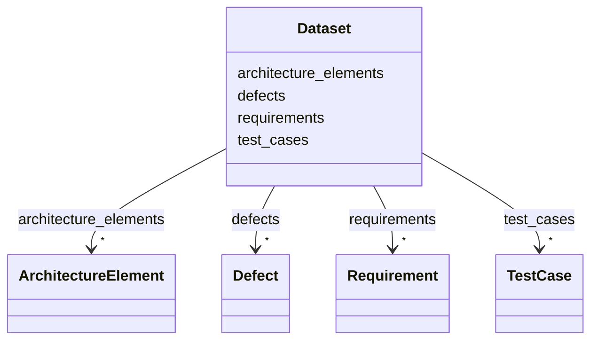

---
search:
  boost: 10.0
---

# Class: Dataset 


_Top-level container (used for collection-level validation/generation)._


<div data-search-exclude markdown="1">


URI: [alm:Dataset](https://vectormind.example/alm-ontology/Dataset)





<!-- no inheritance hierarchy -->

## Class Properties

| Property | Value |
| --- | --- |
| Tree Root | Yes |


## Slots

| Name | Cardinality and Range | Description | Inheritance |
| ---  | --- | --- | --- |
| [requirements](requirements.md) | * <br/> [Requirement](Requirement.md) |  | direct |
| [architecture_elements](architecture_elements.md) | * <br/> [ArchitectureElement](ArchitectureElement.md) |  | direct |
| [test_cases](test_cases.md) | * <br/> [TestCase](TestCase.md) |  | direct |
| [defects](defects.md) | * <br/> [Defect](Defect.md) |  | direct |


## Identifier and Mapping Information


### Schema Source


* from schema: https://vectormind.example/alm-ontology


## Mappings

| Mapping Type | Mapped Value |
| ---  | ---  |
| self | alm:Dataset |
| native | alm:Dataset |


## LinkML Source

<!-- TODO: investigate https://stackoverflow.com/questions/37606292/how-to-create-tabbed-code-blocks-in-mkdocs-or-sphinx -->

### Direct

<details>
```yaml
name: Dataset
description: Top-level container (used for collection-level validation/generation).
from_schema: https://vectormind.example/alm-ontology
rank: 1000
attributes:
  requirements:
    name: requirements
    from_schema: https://vectormind.example/alm-ontology
    rank: 1000
    domain_of:
    - Dataset
    range: Requirement
    multivalued: true
    inlined_as_list: true
  architecture_elements:
    name: architecture_elements
    from_schema: https://vectormind.example/alm-ontology
    rank: 1000
    domain_of:
    - Dataset
    range: ArchitectureElement
    multivalued: true
    inlined_as_list: true
  test_cases:
    name: test_cases
    from_schema: https://vectormind.example/alm-ontology
    rank: 1000
    domain_of:
    - Dataset
    range: TestCase
    multivalued: true
    inlined_as_list: true
  defects:
    name: defects
    from_schema: https://vectormind.example/alm-ontology
    rank: 1000
    domain_of:
    - Dataset
    range: Defect
    multivalued: true
    inlined_as_list: true
tree_root: true

```
</details>

### Induced

<details>
```yaml
name: Dataset
description: Top-level container (used for collection-level validation/generation).
from_schema: https://vectormind.example/alm-ontology
rank: 1000
attributes:
  requirements:
    name: requirements
    from_schema: https://vectormind.example/alm-ontology
    rank: 1000
    owner: Dataset
    domain_of:
    - Dataset
    range: Requirement
    multivalued: true
    inlined: true
    inlined_as_list: true
  architecture_elements:
    name: architecture_elements
    from_schema: https://vectormind.example/alm-ontology
    rank: 1000
    owner: Dataset
    domain_of:
    - Dataset
    range: ArchitectureElement
    multivalued: true
    inlined: true
    inlined_as_list: true
  test_cases:
    name: test_cases
    from_schema: https://vectormind.example/alm-ontology
    rank: 1000
    owner: Dataset
    domain_of:
    - Dataset
    range: TestCase
    multivalued: true
    inlined: true
    inlined_as_list: true
  defects:
    name: defects
    from_schema: https://vectormind.example/alm-ontology
    rank: 1000
    owner: Dataset
    domain_of:
    - Dataset
    range: Defect
    multivalued: true
    inlined: true
    inlined_as_list: true
tree_root: true

```
</details></div>