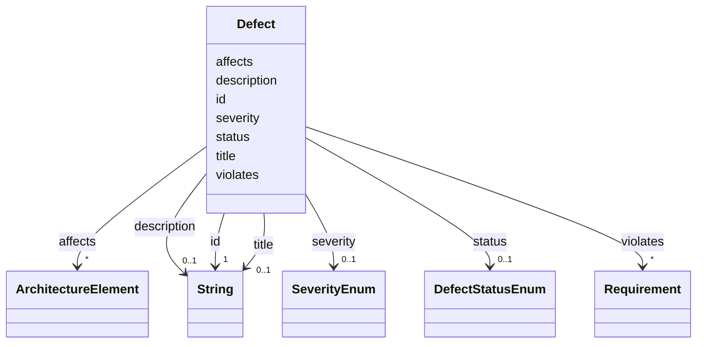

---
search:
  boost: 10.0
---

# Class: Defect 


_A problem that violates requirement(s) in affected component(s)._


<div data-search-exclude markdown="1">


URI: [alm:Defect](https://vectormind.example/alm-ontology/Defect)





<!-- no inheritance hierarchy -->

## Slots

| Name | Cardinality and Range | Description | Inheritance |
| ---  | --- | --- | --- |
| [id](id.md) | 1 <br/> [xsd:string](http://www.w3.org/2001/XMLSchema#string) | Stable identifier (e | direct |
| [title](title.md) | 0..1 <br/> [xsd:string](http://www.w3.org/2001/XMLSchema#string) | Short human-readable title | direct |
| [description](description.md) | 0..1 <br/> [xsd:string](http://www.w3.org/2001/XMLSchema#string) | Free-text description | direct |
| [severity](severity.md) | 0..1 <br/> [SeverityEnum](SeverityEnum.md) |  | direct |
| [status](status.md) | 0..1 <br/> [DefectStatusEnum](DefectStatusEnum.md) |  | direct |
| [affects](affects.md) | * <br/> [ArchitectureElement](ArchitectureElement.md) | Architecture element(s) where this defect manifests | direct |
| [violates](violates.md) | * <br/> [Requirement](Requirement.md) | Requirement(s) this defect violates | direct |


## Usages

| used by | used in | type | used |
| ---  | --- | --- | --- |
| [Dataset](Dataset.md) | [defects](defects.md) | range | [Defect](Defect.md) |


## Identifier and Mapping Information


### Schema Source


* from schema: https://vectormind.example/alm-ontology


## Mappings

| Mapping Type | Mapped Value |
| ---  | ---  |
| self | alm:Defect |
| native | alm:Defect |


## LinkML Source

<!-- TODO: investigate https://stackoverflow.com/questions/37606292/how-to-create-tabbed-code-blocks-in-mkdocs-or-sphinx -->

### Direct

<details>
```yaml
name: Defect
description: A problem that violates requirement(s) in affected component(s).
from_schema: https://vectormind.example/alm-ontology
rank: 1000
slots:
- id
- title
- description
- severity
- status
- affects
- violates

```
</details>

### Induced

<details>
```yaml
name: Defect
description: A problem that violates requirement(s) in affected component(s).
from_schema: https://vectormind.example/alm-ontology
rank: 1000
attributes:
  id:
    name: id
    description: Stable identifier (e.g. REQ-0001, ARC-PROP, TST-0007, DEF-0003).
    from_schema: https://vectormind.example/alm-ontology
    rank: 1000
    identifier: true
    owner: Defect
    domain_of:
    - Requirement
    - ArchitectureElement
    - TestCase
    - Defect
    range: string
    required: true
  title:
    name: title
    annotations:
      searchable:
        tag: searchable
        value: true
      embeddable:
        tag: embeddable
        value: true
    description: Short human-readable title.
    from_schema: https://vectormind.example/alm-ontology
    rank: 1000
    owner: Defect
    domain_of:
    - Requirement
    - TestCase
    - Defect
    range: string
  description:
    name: description
    annotations:
      searchable:
        tag: searchable
        value: true
      embeddable:
        tag: embeddable
        value: true
    description: Free-text description.
    from_schema: https://vectormind.example/alm-ontology
    rank: 1000
    owner: Defect
    domain_of:
    - ArchitectureElement
    - TestCase
    - Defect
    range: string
  severity:
    name: severity
    from_schema: https://vectormind.example/alm-ontology
    rank: 1000
    owner: Defect
    domain_of:
    - Defect
    range: SeverityEnum
  status:
    name: status
    from_schema: https://vectormind.example/alm-ontology
    rank: 1000
    owner: Defect
    domain_of:
    - Defect
    range: DefectStatusEnum
  affects:
    name: affects
    description: Architecture element(s) where this defect manifests.
    from_schema: https://vectormind.example/alm-ontology
    rank: 1000
    owner: Defect
    domain_of:
    - Defect
    range: ArchitectureElement
    multivalued: true
  violates:
    name: violates
    description: Requirement(s) this defect violates.
    from_schema: https://vectormind.example/alm-ontology
    rank: 1000
    owner: Defect
    domain_of:
    - Defect
    range: Requirement
    multivalued: true

```
</details></div>