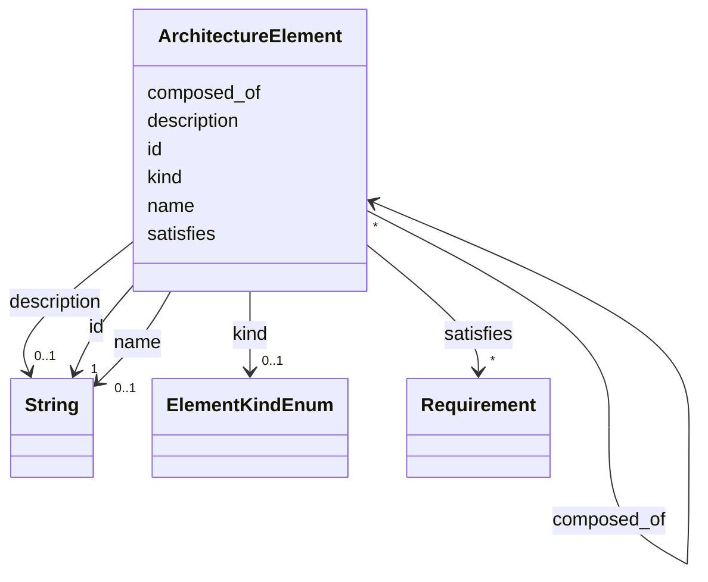

---
search:
  boost: 10.0
---

# Class: ArchitectureElement 


_A feature/component in the technical breakdown._


<div data-search-exclude markdown="1">


URI: [alm:ArchitectureElement](https://vectormind.example/alm-ontology/ArchitectureElement)





<!-- no inheritance hierarchy -->

## Slots

| Name | Cardinality and Range | Description | Inheritance |
| ---  | --- | --- | --- |
| [id](id.md) | 1 <br/> [xsd:string](http://www.w3.org/2001/XMLSchema#string) | Stable identifier (e | direct |
| [name](name.md) | 0..1 <br/> [xsd:string](http://www.w3.org/2001/XMLSchema#string) | Human-readable name | direct |
| [kind](kind.md) | 0..1 <br/> [ElementKindEnum](ElementKindEnum.md) | Coarse kind of an architecture element | direct |
| [description](description.md) | 0..1 <br/> [xsd:string](http://www.w3.org/2001/XMLSchema#string) | Free-text description | direct |
| [composed_of](composed_of.md) | * <br/> [ArchitectureElement](ArchitectureElement.md) | This element is composed of the referenced sub-element(s); transitive | direct |
| [satisfies](satisfies.md) | * <br/> [Requirement](Requirement.md) | Allocation — this architecture element is allocated the referenced requiremen... | direct |


## Usages

| used by | used in | type | used |
| ---  | --- | --- | --- |
| [Requirement](Requirement.md) | [satisfied_by](satisfied_by.md) | range | [ArchitectureElement](ArchitectureElement.md) |
| [ArchitectureElement](ArchitectureElement.md) | [composed_of](composed_of.md) | range | [ArchitectureElement](ArchitectureElement.md) |
| [Defect](Defect.md) | [affects](affects.md) | range | [ArchitectureElement](ArchitectureElement.md) |
| [Dataset](Dataset.md) | [architecture_elements](architecture_elements.md) | range | [ArchitectureElement](ArchitectureElement.md) |


## Identifier and Mapping Information


### Schema Source


* from schema: https://vectormind.example/alm-ontology


## Mappings

| Mapping Type | Mapped Value |
| ---  | ---  |
| self | alm:ArchitectureElement |
| native | alm:ArchitectureElement |


## LinkML Source

<!-- TODO: investigate https://stackoverflow.com/questions/37606292/how-to-create-tabbed-code-blocks-in-mkdocs-or-sphinx -->

### Direct

<details>
```yaml
name: ArchitectureElement
description: A feature/component in the technical breakdown.
from_schema: https://vectormind.example/alm-ontology
rank: 1000
slots:
- id
- name
- kind
- description
- composed_of
- satisfies

```
</details>

### Induced

<details>
```yaml
name: ArchitectureElement
description: A feature/component in the technical breakdown.
from_schema: https://vectormind.example/alm-ontology
rank: 1000
attributes:
  id:
    name: id
    description: Stable identifier (e.g. REQ-0001, ARC-PROP, TST-0007, DEF-0003).
    from_schema: https://vectormind.example/alm-ontology
    rank: 1000
    identifier: true
    owner: ArchitectureElement
    domain_of:
    - Requirement
    - ArchitectureElement
    - TestCase
    - Defect
    range: string
    required: true
  name:
    name: name
    description: Human-readable name.
    from_schema: https://vectormind.example/alm-ontology
    rank: 1000
    owner: ArchitectureElement
    domain_of:
    - ArchitectureElement
    range: string
  kind:
    name: kind
    description: Coarse kind of an architecture element.
    from_schema: https://vectormind.example/alm-ontology
    rank: 1000
    owner: ArchitectureElement
    domain_of:
    - ArchitectureElement
    range: ElementKindEnum
  description:
    name: description
    description: Free-text description.
    from_schema: https://vectormind.example/alm-ontology
    rank: 1000
    owner: ArchitectureElement
    domain_of:
    - ArchitectureElement
    - TestCase
    - Defect
    range: string
  composed_of:
    name: composed_of
    description: This element is composed of the referenced sub-element(s); transitive.
    from_schema: https://vectormind.example/alm-ontology
    rank: 1000
    owner: ArchitectureElement
    domain_of:
    - ArchitectureElement
    range: ArchitectureElement
    multivalued: true
  satisfies:
    name: satisfies
    description: Allocation — this architecture element is allocated the referenced
      requirement(s) (i.e. the requirement is satisfied by this element).
    from_schema: https://vectormind.example/alm-ontology
    rank: 1000
    owner: ArchitectureElement
    domain_of:
    - ArchitectureElement
    inverse: satisfied_by
    range: Requirement
    multivalued: true

```
</details></div>