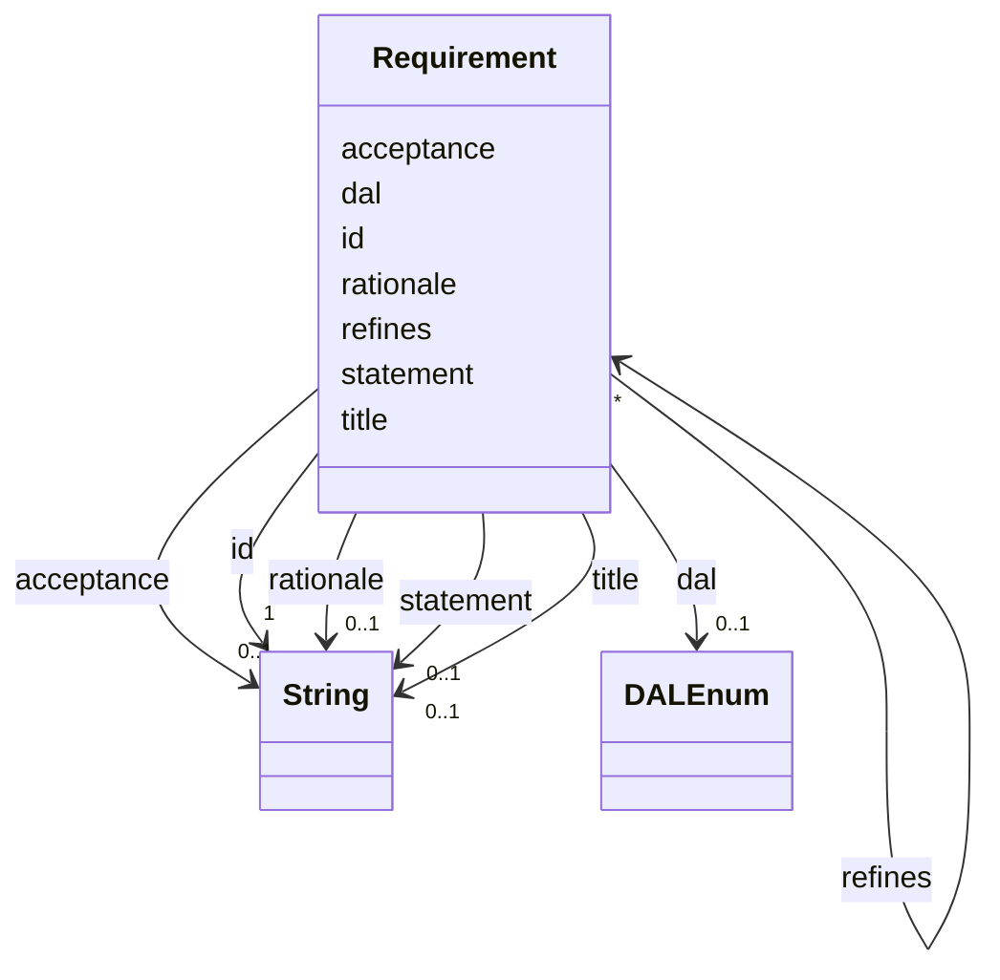

---
search:
  boost: 10.0
---

# Class: Requirement 


_A binding specification statement, with a DAL._


<div data-search-exclude markdown="1">


URI: [alm:Requirement](https://vectormind.example/alm-ontology/Requirement)





<!-- no inheritance hierarchy -->

## Slots

| Name | Cardinality and Range | Description | Inheritance |
| ---  | --- | --- | --- |
| [id](id.md) | 1 <br/> [xsd:string](http://www.w3.org/2001/XMLSchema#string) | Stable identifier (e | direct |
| [title](title.md) | 0..1 <br/> [xsd:string](http://www.w3.org/2001/XMLSchema#string) | Short human-readable title | direct |
| [statement](statement.md) | 0..1 <br/> [xsd:string](http://www.w3.org/2001/XMLSchema#string) | The binding specification text — what shall be achieved | direct |
| [acceptance](acceptance.md) | 0..1 <br/> [xsd:string](http://www.w3.org/2001/XMLSchema#string) | Acceptance criteria that decide whether the requirement is met | direct |
| [rationale](rationale.md) | 0..1 <br/> [xsd:string](http://www.w3.org/2001/XMLSchema#string) | Why this exists | direct |
| [dal](dal.md) | 0..1 <br/> [DALEnum](DALEnum.md) | Design Assurance Level of a requirement | direct |
| [refines](refines.md) | * <br/> [Requirement](Requirement.md) | This requirement refines (decomposes) the referenced parent(s); transitive | direct |


## Usages

| used by | used in | type | used |
| ---  | --- | --- | --- |
| [Requirement](Requirement.md) | [refines](refines.md) | range | [Requirement](Requirement.md) |
| [ArchitectureElement](ArchitectureElement.md) | [satisfies](satisfies.md) | range | [Requirement](Requirement.md) |
| [TestCase](TestCase.md) | [verifies](verifies.md) | range | [Requirement](Requirement.md) |
| [Defect](Defect.md) | [violates](violates.md) | range | [Requirement](Requirement.md) |
| [Dataset](Dataset.md) | [requirements](requirements.md) | range | [Requirement](Requirement.md) |


## Identifier and Mapping Information


### Schema Source


* from schema: https://vectormind.example/alm-ontology


## Mappings

| Mapping Type | Mapped Value |
| ---  | ---  |
| self | alm:Requirement |
| native | alm:Requirement |


## LinkML Source

<!-- TODO: investigate https://stackoverflow.com/questions/37606292/how-to-create-tabbed-code-blocks-in-mkdocs-or-sphinx -->

### Direct

<details>
```yaml
name: Requirement
description: A binding specification statement, with a DAL.
from_schema: https://vectormind.example/alm-ontology
rank: 1000
slots:
- id
- title
- statement
- acceptance
- rationale
- dal
- refines

```
</details>

### Induced

<details>
```yaml
name: Requirement
description: A binding specification statement, with a DAL.
from_schema: https://vectormind.example/alm-ontology
rank: 1000
attributes:
  id:
    name: id
    description: Stable identifier (e.g. REQ-0001, ARC-PROP, TST-0007, DEF-0003).
    from_schema: https://vectormind.example/alm-ontology
    rank: 1000
    identifier: true
    owner: Requirement
    domain_of:
    - Requirement
    - ArchitectureElement
    - TestCase
    - Defect
    range: string
    required: true
  title:
    name: title
    description: Short human-readable title.
    from_schema: https://vectormind.example/alm-ontology
    rank: 1000
    owner: Requirement
    domain_of:
    - Requirement
    - TestCase
    - Defect
    range: string
  statement:
    name: statement
    description: The binding specification text — what shall be achieved.
    from_schema: https://vectormind.example/alm-ontology
    rank: 1000
    owner: Requirement
    domain_of:
    - Requirement
    range: string
  acceptance:
    name: acceptance
    description: Acceptance criteria that decide whether the requirement is met.
    from_schema: https://vectormind.example/alm-ontology
    rank: 1000
    owner: Requirement
    domain_of:
    - Requirement
    range: string
  rationale:
    name: rationale
    description: Why this exists.
    from_schema: https://vectormind.example/alm-ontology
    rank: 1000
    owner: Requirement
    domain_of:
    - Requirement
    range: string
  dal:
    name: dal
    description: Design Assurance Level of a requirement.
    from_schema: https://vectormind.example/alm-ontology
    rank: 1000
    owner: Requirement
    domain_of:
    - Requirement
    range: DALEnum
  refines:
    name: refines
    description: This requirement refines (decomposes) the referenced parent(s); transitive.
    from_schema: https://vectormind.example/alm-ontology
    rank: 1000
    owner: Requirement
    domain_of:
    - Requirement
    range: Requirement
    multivalued: true

```
</details></div>