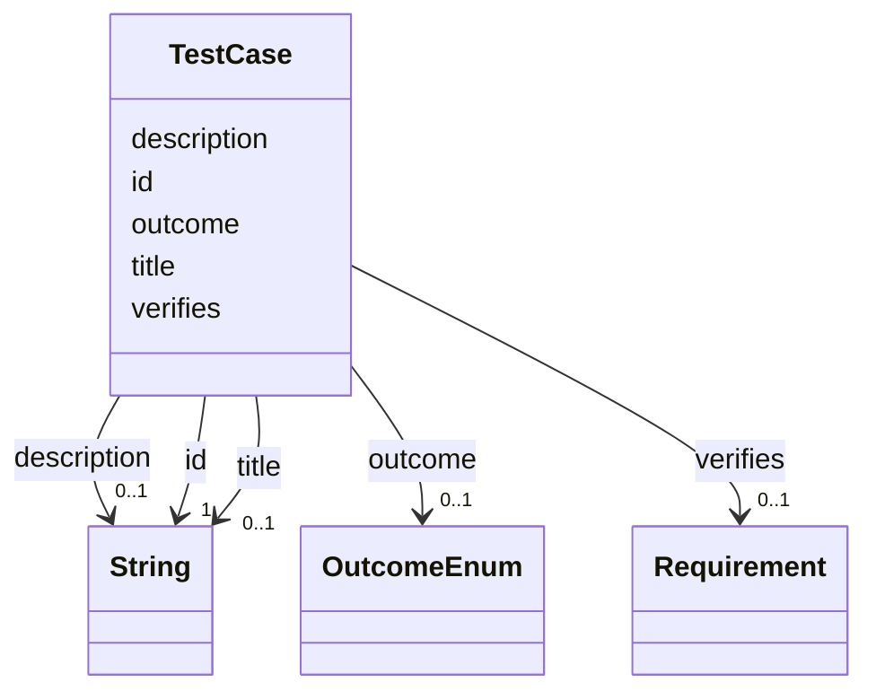

---
search:
  boost: 10.0
---

# Class: TestCase 


_A verification that asserts a requirement, carrying an outcome._


<div data-search-exclude markdown="1">


URI: [alm:TestCase](https://vectormind.example/alm-ontology/TestCase)





<!-- no inheritance hierarchy -->

## Slots

| Name | Cardinality and Range | Description | Inheritance |
| ---  | --- | --- | --- |
| [id](id.md) | 1 <br/> [xsd:string](http://www.w3.org/2001/XMLSchema#string) | Stable identifier (e | direct |
| [title](title.md) | 0..1 <br/> [xsd:string](http://www.w3.org/2001/XMLSchema#string) | Short human-readable title | direct |
| [description](description.md) | 0..1 <br/> [xsd:string](http://www.w3.org/2001/XMLSchema#string) | Free-text description | direct |
| [verifies](verifies.md) | 0..1 <br/> [Requirement](Requirement.md) | The single requirement this test case verifies (carries an outcome) | direct |
| [outcome](outcome.md) | 0..1 <br/> [OutcomeEnum](OutcomeEnum.md) | Result carried by a verification relationship | direct |


## Usages

| used by | used in | type | used |
| ---  | --- | --- | --- |
| [Dataset](Dataset.md) | [test_cases](test_cases.md) | range | [TestCase](TestCase.md) |


## Identifier and Mapping Information


### Schema Source


* from schema: https://vectormind.example/alm-ontology


## Mappings

| Mapping Type | Mapped Value |
| ---  | ---  |
| self | alm:TestCase |
| native | alm:TestCase |


## LinkML Source

<!-- TODO: investigate https://stackoverflow.com/questions/37606292/how-to-create-tabbed-code-blocks-in-mkdocs-or-sphinx -->

### Direct

<details>
```yaml
name: TestCase
description: A verification that asserts a requirement, carrying an outcome.
from_schema: https://vectormind.example/alm-ontology
rank: 1000
slots:
- id
- title
- description
- verifies
- outcome

```
</details>

### Induced

<details>
```yaml
name: TestCase
description: A verification that asserts a requirement, carrying an outcome.
from_schema: https://vectormind.example/alm-ontology
rank: 1000
attributes:
  id:
    name: id
    description: Stable identifier (e.g. REQ-0001, ARC-PROP, TST-0007, DEF-0003).
    from_schema: https://vectormind.example/alm-ontology
    rank: 1000
    identifier: true
    owner: TestCase
    domain_of:
    - Requirement
    - ArchitectureElement
    - TestCase
    - Defect
    range: string
    required: true
  title:
    name: title
    description: Short human-readable title.
    from_schema: https://vectormind.example/alm-ontology
    rank: 1000
    owner: TestCase
    domain_of:
    - Requirement
    - TestCase
    - Defect
    range: string
  description:
    name: description
    description: Free-text description.
    from_schema: https://vectormind.example/alm-ontology
    rank: 1000
    owner: TestCase
    domain_of:
    - ArchitectureElement
    - TestCase
    - Defect
    range: string
  verifies:
    name: verifies
    description: The single requirement this test case verifies (carries an outcome).
    from_schema: https://vectormind.example/alm-ontology
    rank: 1000
    owner: TestCase
    domain_of:
    - TestCase
    range: Requirement
  outcome:
    name: outcome
    description: Result carried by a verification relationship.
    from_schema: https://vectormind.example/alm-ontology
    rank: 1000
    owner: TestCase
    domain_of:
    - TestCase
    range: OutcomeEnum

```
</details></div>